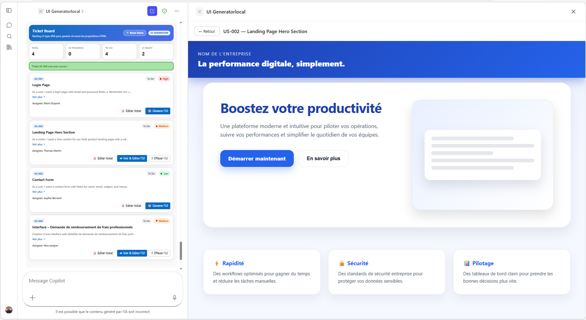
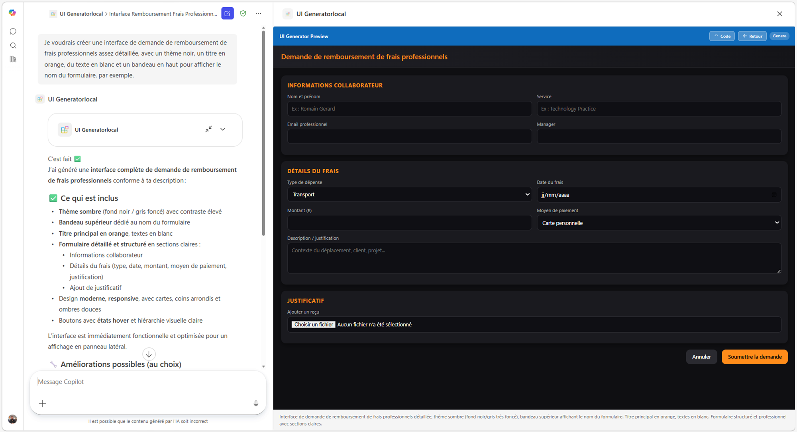
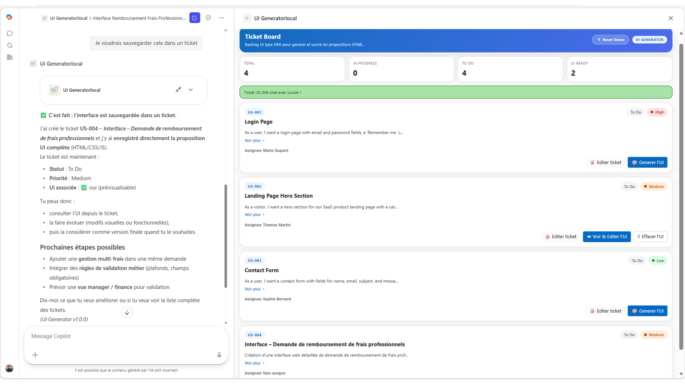

# Générateur d'interfaces UI et gestion de backlog pour M365 Copilot

> Agent déclaratif Microsoft 365 Copilot capable de **générer des interfaces HTML/CSS/JS à la volée**, de **gérer un backlog de tickets UI**, puis de **combiner les deux** pour créer, visualiser, itérer et sauvegarder des propositions d'interface directement dans le flux de conversation.

### 🎨 Génération d'une landing page Hero depuis un ticket



### 📋 Formulaire applicatif complexe généré en une phrase

> *« Je voudrais créer une interface de demande de remboursement de frais professionnels assez détaillé, avec un thème noir, un titre en orange, du texte en blanc et un bandeau en haut pour afficher le nom du formulaire. »*



### 💻 Vue code : inspectez et sauvegardez le HTML/CSS/JS généré


### 🗂️ Ticket Board plein écran : gérez votre backlog complet



> 🚀 **Première fois ?** Consulte le [Guide de démarrage](docs/getting-started.md) : de l'installation de VS Code jusqu'au premier F5.

---

## Sommaire

- [Vue d'ensemble](#vue-densemble)
- [Cas d'usage couverts](#cas-dusage-couverts)
- [Fonctionnalités clés](#fonctionnalités-clés)
- [Architecture](#architecture)
- [Stack technique](#stack-technique)
- [Outils MCP disponibles](#outils-mcp-disponibles)
- [Widgets HTML](#widgets-html)
- [Structure du projet](#structure-du-projet)
- [Prérequis](#prérequis)
- [Installation](#installation)
- [🚀 Guide de démarrage](#-guide-de-démarrage)
- [Flux d'utilisation](#flux-dutilisation)
- [Données et persistance](#données-et-persistance)
- [Références des skills](#références-des-skills)
- [Version](#version)
- [Template de référence](#template-de-référence)
- [Références documentaires](#références-documentaires)

---

## Vue d'ensemble

Ce projet est un **agent déclaratif M365 Copilot** connecté à un **MCP Server Node.js/TypeScript**. Il permet de transformer une demande en langage naturel en interface HTML/CSS/JS exploitable, tout en fournissant une gestion simple d'un backlog de tickets UI.

L'objectif est de couvrir un cycle complet :

1. décrire une interface,
2. générer un prototype,
3. le prévisualiser dans un widget,
4. l'itérer par chat,
5. le rattacher à un ticket ou l'enregistrer pour la suite.

---

## Cas d'usage couverts

### Cas 1 : Générer une UI à partir d'un ticket existant

L'utilisateur sélectionne un ticket dans le backlog, demande à l'agent de produire une proposition d'interface, puis visualise le résultat dans le panneau latéral. Il peut ensuite affiner l'interface par conversation et conserver la proposition associée au ticket.

### Cas 2 : Créer un ticket puis générer sa UI

L'utilisateur décrit un besoin, l'agent crée un ticket avec les métadonnées utiles (statut, priorité, assignation), puis génère l'interface correspondante à partir de cette nouvelle entrée du backlog.

### Cas 3 : Générer une UI libre sans ticket

L'utilisateur décrit directement une interface sans passer par le backlog. L'agent génère alors une UI autonome, permet les itérations successives, puis propose éventuellement de sauvegarder le résultat dans un ticket existant ou nouvellement créé.

---

## Fonctionnalités clés

Ce projet est un **agent déclaratif Microsoft 365 Copilot** (Declarative Copilot Agent), connecté à un **MCP Server** via le protocole **Model Context Protocol**, avec des **widgets interactifs MCP Apps** (Embedded Apps) affichés directement dans le chat M365 Copilot.

- **Agent déclaratif M365 Copilot** : manifest v1.26, agent v1.6, plugin v2.4 avec `RemoteMCPServer`
- **MCP Server Node.js/TypeScript/Express** : 10 outils exposés via Streamable HTTP
- **Widgets MCP Apps** : 2 widgets HTML interactifs intégrés au chat (backlog + preview)
- Génération d'interfaces **HTML/CSS/JS** à partir d'une description en langage naturel
- Mise à jour incrémentale d'une UI existante via le chat
- Gestion d'un backlog de tickets UI avec **statut**, **priorité** et **assigné**
- Prévisualisation immédiate en **mode plein écran** avec rafraîchissement automatique en temps réel
- Sauvegarde d'une proposition d'interface sur un ticket existant ou nouveau
- Réinitialisation rapide des données de démonstration
- Stockage simple sur fichiers JSON, **sans base de données**

---

## Architecture

```text
┌───────────────────────────────────────────────────────┐
│                  M365 Copilot Chat                    │
│        (Declarative Agent + MCP App widgets)          │
└──────────────────────────┬────────────────────────────┘
                           │ MCP Protocol (HTTP/SSE)
┌──────────────────────────▼────────────────────────────┐
│                 MCP Server (Node.js)                  │
│                                                       │
│  Tools: generateUI, updateUI, listTickets, getTicket  │
│         generateUIFromTicket, saveUIToTicket          │
│         createTicket, updateTicket, resetTickets      │
│         viewTicketUI                                  │
│                                                       │
│  Widgets HTML (MCP Apps)                              │
│    · tickets-list-widget (backlog + preview)          │
│    · ui-preview-widget (standalone preview)           │
└───────────────────────────────────────────────────────┘
         │
    ┌────▼────┐
    │  JSON   │  tickets.json (runtime data)
    │  Files  │  tickets-default.json (demo reset)
    └─────────┘
```

---

## Stack technique

| Composant | Technologie |
|-----------|-------------|
| Agent | M365 Declarative Copilot |
| Manifeste | `manifest.json` v1.26 |
| Schéma d'agent déclaratif | v1.6 |
| Serveur MCP | Node.js + TypeScript + Express |
| Transport | Streamable HTTP |
| Widgets interactifs | `@modelcontextprotocol/ext-apps` |
| UI / thème | Fluent UI Web Components |
| Développement local | M365 Agents Toolkit, devtunnel, F5 |
| Persistance | Fichiers JSON (`tickets.json`) |

---

## Outils MCP disponibles

Le serveur expose **10 outils MCP**.

| Tool | Description |
|------|-------------|
| `generateUI` | Génère du HTML/CSS/JS depuis une description libre, sans ticket |
| `updateUI` | Met à jour une UI libre déjà générée |
| `listTickets` | Liste tous les tickets dans le widget de backlog |
| `getTicket` | Récupère le détail d'un ticket, y compris sa proposition d'UI |
| `generateUIFromTicket` | Génère une UI à partir de la description d'un ticket et l'enregistre sur ce ticket |
| `saveUIToTicket` | Sauvegarde une UI dans un ticket existant |
| `createTicket` | Crée un nouveau ticket, avec option de `htmlCode` |
| `updateTicket` | Met à jour les champs d'un ticket |
| `resetTickets` | Réinitialise le backlog avec les données de démonstration |
| `viewTicketUI` | Ouvre la proposition d'UI d'un ticket dans le panneau de prévisualisation |

---

## Widgets HTML

Le projet embarque **2 widgets HTML** utilisés comme MCP Apps dans le chat Copilot.

### 1. `tickets-list-widget.html`

Widget de backlog affichant :

- les tickets avec badges de statut,
- les priorités avec code couleur,
- les actions **Generate UI**, **View & Edit UI** et **Delete UI**,
- un mode de prévisualisation plein écran,
- un rafraîchissement automatique par polling.

### 2. `ui-preview-widget.html`

Widget de prévisualisation autonome destiné aux générations libres (cas 3), avec :

- rendu HTML direct,
- affichage du code,
- coloration syntaxique via **Prism.js**.

---

## Structure du projet

```text
Copilot-Generate-UI-From-UserStory-and-manage-Tickets/
├── appPackage/
│   ├── manifest.json                 ← Manifeste M365 app (v1.26)
│   ├── uiGeneratorAgent.json         ← Définition de l'agent (v1.6)
│   ├── ai-plugin.json                ← Outils MCP + routage LLM (v2.4)
│   └── instruction.txt               ← Prompt système du LLM
├── mcp-server/
│   ├── src/
│   │   ├── index.ts                  ← Serveur Express + CORS
│   │   └── mcp-server.ts             ← 10 outils MCP + 2 ressources widget
│   ├── assets/
│   │   ├── tickets-list-widget.html  ← Backlog + preview plein écran
│   │   └── ui-preview-widget.html    ← Prévisualisation autonome
│   ├── data/
│   │   ├── tickets.json              ← Données runtime
│   │   └── tickets-default.json      ← Données de démonstration
│   ├── package.json
│   └── .env.sample
├── docs/
│   ├── getting-started.md
│   ├── TEMPLATE.md
│   └── skills/                       ← Documentation de référence
├── m365agents.yml                    ← Provisionnement + déploiement
├── m365agents.local.yml              ← Debug local avec devtunnel
└── env/
    └── .env.dev                      ← Variables d'environnement
```

---

## Prérequis

Avant de lancer le projet, assurez-vous de disposer de :

- **Node.js 18, 20 ou 22**
- **Visual Studio Code** avec l'extension **Microsoft 365 Agents Toolkit**
- **Un compte Microsoft 365** avec licence Copilot
- Aucun secret tiers supplémentaire : **pas de clé API** et **pas de base de données** nécessaires

---

## Installation

```bash
git clone https://github.com/romain-gerard-exp/Copilot-Generate-UI-From-UserStory-and-manage-Tickets.git
cd Copilot-Generate-UI-From-UserStory-and-manage-Tickets
cd mcp-server
cp .env.sample .env
npm install
cd ..
# F5 dans VS Code → Debug in Copilot (Edge)
```

### Notes d'installation

- Le projet peut être exécuté localement sans base de données.
- Les tickets sont stockés dans des fichiers JSON pour simplifier les démonstrations et les itérations.
- Le flux de debug standard repose sur **M365 Agents Toolkit** et **devtunnel**.

---

## 🚀 Guide de démarrage

Pour une mise en route pas à pas, consultez le guide dédié : [docs/getting-started.md](docs/getting-started.md)

Démarrage rapide :

1. Ouvrir le projet dans VS Code
2. Vérifier la configuration locale dans `env/` et `mcp-server/.env`
3. Lancer le debug avec **F5**
4. Attendre l'ouverture de Copilot dans Edge
5. Interagir avec l'agent, par exemple :
   - *Crée un formulaire d'inscription moderne avec prénom, nom, email et bouton principal*
   - *Affiche le backlog et génère l'UI du ticket le plus prioritaire*
   - *Sauvegarde cette proposition sur un nouveau ticket UI*

---

## Flux d'utilisation

### Générer une UI depuis un ticket existant

1. Lister les tickets du backlog
2. Sélectionner un ticket
3. Générer une proposition d'interface
4. Visualiser le rendu dans le panneau latéral
5. Demander des modifications en langage naturel
6. Enregistrer la version finale sur le ticket

### Créer un ticket puis générer sa UI

1. Décrire le besoin métier ou fonctionnel
2. Créer le ticket avec ses métadonnées
3. Générer l'interface correspondante
4. Réviser le résultat dans le widget
5. Mettre à jour le ticket si nécessaire

### Générer une UI libre sans ticket

1. Décrire une interface librement dans le chat
2. Afficher la preview dans le widget autonome
3. Itérer autant de fois que nécessaire
4. Choisir ensuite de conserver le résultat tel quel ou de le rattacher à un ticket

---

## Données et persistance

La persistance s'appuie uniquement sur des fichiers JSON :

- `mcp-server/data/tickets.json` : état courant du backlog
- `mcp-server/data/tickets-default.json` : état de référence pour la réinitialisation

Ce choix permet :

- une prise en main rapide,
- un environnement de démonstration simple,
- l'absence de dépendance à une base de données,
- des réinitialisations instantanées via l'outil `resetTickets`.

---

## Références des skills

| Skill | Description |
|-------|-------------|
| [ui-generation-workflow.md](docs/skills/ui-generation-workflow.md) | **Comment générer, éditer et sauvegarder une interface depuis le chat Copilot** |
| [declarative-agent-mcp-setup.md](docs/skills/declarative-agent-mcp-setup.md) | Comment créer un agent déclaratif M365 connecté à un MCP Server |
| [mcp-app-widgets.md](docs/skills/mcp-app-widgets.md) | Comment construire des widgets interactifs dans le chat M365 |
| [mcp-app-csp-resources.md](docs/skills/mcp-app-csp-resources.md) | Comment débloquer les ressources CDN dans les iframes M365 |
| [widget-display-and-resourceuri.md](docs/skills/widget-display-and-resourceuri.md) | Comment contrôler quel widget s'ouvre et éviter les boucles |
| [widget-fullscreen-and-state.md](docs/skills/widget-fullscreen-and-state.md) | Comment gérer le plein écran sans perdre l'état du widget |
| [widget-realtime-updates.md](docs/skills/widget-realtime-updates.md) | Comment mettre à jour un widget en temps réel pendant que l'IA travaille |
| [llm-tool-routing.md](docs/skills/llm-tool-routing.md) | Comment guider le LLM pour qu'il choisisse le bon outil |

---

## Version

| Version | Description |
|---------|-------------|
| `v1.0.0` | Version initiale : agent complet avec 3 cas d'usage UI, widget backlog, preview plein écran et polling temps réel |

---

## Template de référence

> Template de base : voir [docs/TEMPLATE.md](docs/TEMPLATE.md)

---

## Références documentaires

- Declarative Agents for Microsoft 365 : https://aka.ms/teams-toolkit-declarative-agent
- Model Context Protocol : https://modelcontextprotocol.io/
- MCP Apps (`@modelcontextprotocol/ext-apps`) : https://www.npmjs.com/package/@modelcontextprotocol/ext-apps
