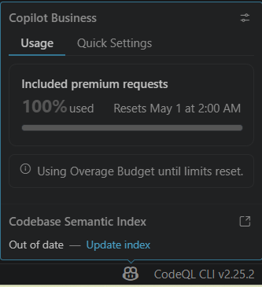
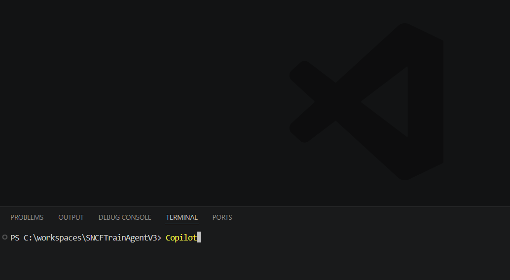
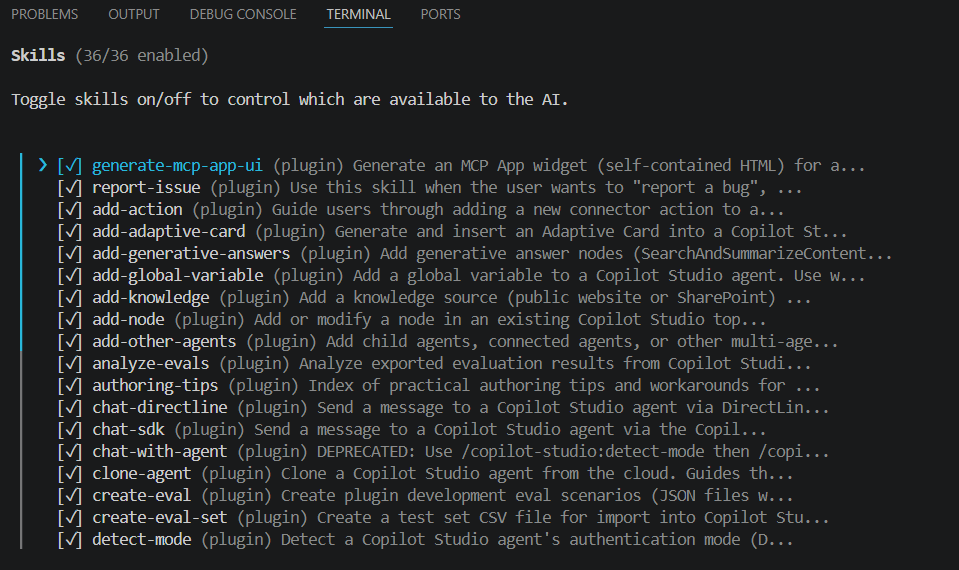

# Guide de démarrage - Copilot-Generate-UI-From-UserStory-and-manage-Tickets

> **Pour qui ?** Ce guide est destiné à quelqu'un qui n'a jamais utilisé VS Code, Node.js, ou les outils Microsoft 365 pour développeurs. Il documente exactement ce qu'il faut installer et dans quel ordre pour reproduire ce projet. Chaque étape correspond à quelque chose que le premier développeur de ce projet a dû découvrir par lui-même.

---

## Étape 0 - Prérequis compte

Avant d'installer quoi que ce soit, vérifier que tu as :
- ✅ Un **compte Microsoft 365** (E3, E5, Business Premium...)
- ✅ La licence **Copilot 365** (nécessaire pour que l'agent soit accessible dans l'interface Copilot de Teams)
- ✅ Un **compte GitHub** (gratuit)
- ✅ Un **accès administrateur** sur ton poste (pour installer des logiciels)

### ⚠️ Note sur le plan GitHub Copilot et les modèles IA pour le vibe coding

GitHub Copilot existe en plusieurs plans. Le **plan gratuit** donne accès à des modèles moins performants, moins adaptés à un projet complexe comme celui-ci.

**Pour travailler sérieusement, un plan payant est fortement recommandé :**

| Plan | Modèles disponibles |
|------|---------------------|
| Free | GPT-4o, Claude 3.5 Sonnet (quota très limité) |
| **Pro** | Claude Sonnet 4.6, GPT-4.1, GPT-5... quota étendu |
| **Business** | Idem Pro + contrôles entreprise |

> Ce projet a été développé avec un **plan payant** (Pro ou Business) et le modèle **Claude Sonnet 4.6**. La qualité du code généré, la compréhension du contexte et la capacité à suivre des instructions complexes dépendent directement du modèle utilisé.

### Surveiller sa consommation de crédits

Les plans payants ont un quota de **"premium requests"** mensuel. Les requêtes vers des modèles avancés (Claude Sonnet, GPT-5...) consomment ce quota plus vite.

Pour voir ta consommation dans VS Code : cliquer sur l'icône Copilot en bas à droite → **Usage**



*Ici : 100% du quota "Included premium requests" utilisé - le système bascule sur l'"Overage Budget" (facturation au-delà du forfait). Le quota se renouvelle le 1er du mois.*

> 💡 **Conseil :** activer un budget d'overage limité (ex: 10$) pour ne pas être bloqué en fin de mois sans mauvaise surprise. Configurable dans les paramètres GitHub → Billing.

---

## Étape 1 - Installer Git

Git est nécessaire pour cloner et gérer le code source.

1. Aller sur [git-scm.com/downloads](https://git-scm.com/downloads)
2. Télécharger et installer Git pour Windows
3. Lors de l'installation, laisser les options par défaut
4. Vérifier l'installation : ouvrir un terminal et taper :
   ```bash
   git --version
   # Doit afficher : git version 2.x.x
   ```

---

## Étape 2 - Installer Node.js

Node.js est le moteur qui exécute le MCP Server.

1. Aller sur [nodejs.org](https://nodejs.org)
2. Télécharger la version **LTS** (Long Term Support) - actuellement Node.js 20 ou 22
3. Installer avec les options par défaut
4. Vérifier :
   ```bash
   node --version   # v20.x.x ou v22.x.x
   npm --version    # 10.x.x
   ```

> ⚠️ Ne pas utiliser Node.js 16 ou inférieur - le `fetch` natif n'est disponible qu'à partir de Node.js 18.

---

## Étape 3 - Installer VS Code

VS Code est l'éditeur de code.

1. Aller sur [code.visualstudio.com](https://code.visualstudio.com)
2. Télécharger et installer
3. Ouvrir VS Code

---

## Étape 4 - Installer les extensions VS Code

Les extensions sont installables depuis le panneau Extensions (icône carré dans la barre de gauche, ou `Ctrl+Shift+X`).

### Extension obligatoire 1 : M365 Agents Toolkit

C'est l'extension qui gère le devtunnel, le provisioning de l'agent dans M365, et le démarrage en F5.

1. Dans VS Code, ouvrir Extensions (`Ctrl+Shift+X`)
2. Chercher : **"Teams Toolkit"** ou **"M365 Agents Toolkit"**
3. Installer l'extension de Microsoft (éditeur : Microsoft)
4. Un nouveau panneau apparaît dans la barre de gauche (icône Teams)

> 💡 Le nom a changé : anciennement "Teams Toolkit", maintenant "M365 Agents Toolkit". Les deux fonctionnent pareil.

### Extension obligatoire 2 : GitHub Copilot

GitHub Copilot est l'assistant IA intégré dans VS Code.

1. Chercher : **"GitHub Copilot"**
2. Installer l'extension de GitHub
3. Se connecter avec ton compte GitHub quand demandé

### Extension utile : GitHub Copilot dans le terminal

**C'est ce qui permet d'avoir une conversation IA directement dans le terminal VS Code - comme ce projet a été développé.**

1. Ouvrir le terminal intégré VS Code : `` Ctrl+` `` (ou `Ctrl+ù` selon le clavier)
2. Installer la GitHub CLI :
   ```bash
   winget install GitHub.cli
   ```
   Ou depuis [cli.github.com](https://cli.github.com)
3. Se connecter :
   ```bash
   gh auth login
   ```
   Suivre les instructions (navigateur s'ouvre pour authentification)
4. Démarrer une conversation Copilot dans le terminal :
   - Via la palette de commandes VS Code : `Ctrl+Shift+P` → **"GitHub Copilot: Open Agent"** (ou "Open Copilot in Terminal")
   - Ou directement depuis le panneau Copilot de VS Code (icône chat dans la barre de gauche)

> 💡 Ce projet entier a été développé en dictant des demandes en français dans ce terminal, sans écrire de code manuellement.

---

## Étape 4b - Lancer Copilot dans le terminal (détail)

Une fois la GitHub CLI installée et connectée, voici comment démarrer une session Copilot dans le terminal VS Code.

### 1. Ouvrir un nouveau terminal

Dans VS Code : menu **Terminal** → **New Terminal** (ou `Ctrl+Shift+ù`)


### 2. Taper la commande `Copilot`

Dans le terminal qui s'ouvre (PowerShell), taper :

```
Copilot
```



### 3. Copilot démarre

GitHub Copilot CLI se lance avec son interface dans le terminal. Le message de bienvenue indique la version et le nombre de skills/plugins chargés.


Le message `Environment loaded: X hooks, X skills, X MCP server, X plugins, X agents, Visual Studio Code connected` confirme que tout est bien chargé.

### 4. Vérifier les skills installés

Pour voir la liste des skills disponibles, taper `/skills` puis Entrée :


La liste complète des skills s'affiche avec leur statut (activé/désactivé) :



> 💡 Les skills sont les capacités spécialisées de Copilot. Pour ce projet, les guides et références utiles doivent être rangés dans `docs/skills/`.

### 5. Quitter Copilot

Appuyer sur **Échap** pour quitter l'interface Copilot et revenir au terminal PowerShell normal.

---

## Étape 5 - Cloner le projet (optionnel)

> Si tu veux partir de ce projet comme base, clone-le. Si tu préfères démarrer un projet vierge, passe directement à l'étape suivante et utilise les guides de référence dans `docs/skills/`.

```bash
git clone https://github.com/romain-gerard-exp/Copilot-Generate-UI-From-UserStory-and-manage-Tickets.git
cd Copilot-Generate-UI-From-UserStory-and-manage-Tickets
```

---

## Étape 6 - Créer le fichier de configuration local

Le fichier `mcp-server/.env` n'est pas inclus dans le repo (gitignored). Il faut le créer à partir du modèle fourni :

```bash
cd mcp-server
copy .env.sample .env
```

Puis ouvrir `mcp-server/.env` et laisser simplement :

```env
PORT=3978
```

> ✅ **Aucune autre variable n'est nécessaire** pour ce projet.
>
> ✅ **Aucune clé API** n'est à créer.
>
> ✅ **Aucun paramétrage Dataverse** n'est nécessaire.

---

## Étape 7 - Installer les dépendances Node.js

```bash
npm install
```

---

## Étape 8 - Se connecter à M365 dans VS Code

1. Dans VS Code, cliquer sur l'icône **M365 Agents Toolkit** dans la barre de gauche
2. Cliquer sur **"Sign in to Microsoft 365"** dans la section **ACCOUNTS**
3. Se connecter avec le compte qui a la licence Copilot 365
4. Vérifier dans la section **ENVIRONMENT** que l'environnement `dev` ne montre plus le warning (le toolkit affiche "Sign in with your correct Azure account" mais il s'agit bien du compte Microsoft 365 professionnel, le même que Teams)


*Le panneau M365 Agents Toolkit montre les sections ACCOUNTS, ENVIRONMENT, DEVELOPMENT et LIFECYCLE. Si le warning "Sign in with your correct Azure account" apparaît sous l'environnement, cliquer dessus et se connecter avec le compte Microsoft 365 professionnel (pas besoin d'un abonnement Azure, c'est le même compte que celui utilisé pour Teams).*

---

## Étape 9 - Lancer l'agent en debug

### Ouvrir le panneau Run and Debug

Dans VS Code, deux façons d'accéder au debug :
- **Raccourci clavier :** `F5` directement (lance immédiatement le dernier profil sélectionné)
- **Panneau Run and Debug :** cliquer sur l'icône dans la barre de gauche (icône triangle avec un insecte), puis cliquer sur le bouton **▶ vert** en haut


*Le bouton ▶ vert en haut du panneau "RUN AND DEBUG" lance le debug. Le menu déroulant à côté ("Debug in...") permet de choisir le profil.*

### Sélectionner le bon profil

Si plusieurs profils apparaissent dans le menu déroulant, sélectionner **"Debug in Copilot (Edge)"**.

> 💡 La première fois, si la liste est vide ou que F5 ne fait rien, vérifier que l'extension **M365 Agents Toolkit** est bien installée - c'est elle qui ajoute le profil de debug.

### Ce qui se passe après F5

VS Code va automatiquement :
1. Créer un **devtunnel** (tunnel HTTPS public vers ton localhost)
2. **Builder** le MCP server TypeScript (`npm run build`)
3. **Uploader** l'app dans ton tenant M365
4. Ouvrir **Edge** sur [m365.cloud.microsoft](https://m365.cloud.microsoft)

Dans Edge, aller dans **Copilot** → l'agent **"UI Generator"** doit apparaître dans la liste.

> ⚠️ La première fois, M365 peut mettre quelques minutes à reconnaître l'agent. Si l'agent n'apparaît pas après 2-3 minutes, relancer F5.

> ⚠️ Si Edge s'ouvre mais que tu vois une erreur de connexion au MCP server, vérifier que le terminal "MCP Server" dans VS Code ne montre pas d'erreur de démarrage.

### Premiers prompts de test

Une fois l'agent lancé, tu peux commencer avec :
- `Montre-moi les tickets`
- `Génère un formulaire de contact`
- `Crée une interface pour le ticket US-001`

---

## Étape 10 - Arrêter le debug proprement (entre deux tests)

Quand on arrête une session de debug et qu'on veut en relancer une propre, il faut faire un peu de ménage - sinon les serveurs locaux continuent de tourner en arrière-plan et le prochain F5 peut avoir des conflits de port.

### 1. Fermer le navigateur Edge ouvert par le debug

Fermer simplement la fenêtre Edge qui s'est ouverte sur M365 Copilot.

### 2. Arrêter le debug dans VS Code

Cliquer sur le carré rouge ■ dans la barre de debug en haut de VS Code (ou `Shift+F5`).

### 3. Kill les terminaux de serveur qui tournent encore

Après l'arrêt du debug, plusieurs terminaux restent souvent ouverts et actifs (MCP server, devtunnel...). Il faut les tuer manuellement.

**Méthode :** Clic droit sur le terminal concerné → **Kill Terminal**


*Sur cette capture : le terminal "Start backend Task" fait tourner le serveur MCP (`npm start`, `node dist/index.js`). Un clic droit → "Kill Terminal" l'arrête proprement.*

> 💡 Les terminaux créés par le toolkit ont des noms reconnaissables : "Start local tunnel", "Start backend", "Build project", etc. Les identifier et les tuer tous avant de relancer F5.

> ⚠️ Si tu ne kills pas les terminaux et que tu relances F5, tu peux avoir une erreur `EADDRINUSE: address already in use` - le port 3978 (ou autre) est déjà occupé par l'ancienne instance du serveur.

---

## Récapitulatif des prérequis

| Outil / élément | Version minimale / valeur | Lien / remarque |
|-----------------|---------------------------|-----------------|
| Git | 2.x | [git-scm.com](https://git-scm.com/downloads) |
| Node.js | 18 LTS (recommandé : 20 ou 22) | [nodejs.org](https://nodejs.org) |
| VS Code | dernière version | [code.visualstudio.com](https://code.visualstudio.com) |
| GitHub CLI | dernière version | [cli.github.com](https://cli.github.com) |
| Extension M365 Agents Toolkit | dernière version | via VS Code Extensions |
| Extension GitHub Copilot | dernière version | via VS Code Extensions |
| Compte M365 avec licence Copilot | - | via ton organisation |
| Fichier `.env` | `PORT=3978` | à créer dans `mcp-server/.env` |

> ✅ Pas de clé API.
>
> ✅ Pas de configuration Dataverse.

---

## Démarrer ton propre agent - les prompts de départ

> Une fois l'environnement en place, voici comment démarrer un nouveau projet d'agent similaire en donnant les bons prompts à GitHub Copilot dans le terminal. La clé : **toujours donner le contexte et pointer vers les guides de référence dans `docs/skills/`** - Copilot est bien plus efficace quand il sait exactement où chercher.

Les prompts ci-dessous sont des modèles à adapter à ton cas. Ils sont écrits pour être copiés-collés dans le terminal Copilot (`Copilot` dans le terminal VS Code).

---

### Phase 1 - Créer l'agent de base avec un MCP Server

**Quand ?** En partant d'un projet vide ou d'un template M365 Agents Toolkit cloné.

**Prompt type :**

```
Je veux créer un agent déclaratif M365 Copilot connecté à un MCP Server Node.js/Express/TypeScript.
L'agent s'appelle "UI Generator" et doit permettre de générer des interfaces HTML/CSS/JS à partir de user stories et de tickets.

Pour référence, lis les guides pertinents dans docs/skills/.

L'agent doit avoir :
- Un manifest.json et un declarative agent corrects
- Un ai-plugin.json branché sur le MCP Server
- Un serveur local simple avec PORT=3978
- Des outils pour lister des tickets et générer une interface à partir d'un ticket

Le projet est déjà cloné localement. Commence par analyser la structure existante.
```

---

### Phase 2 - Générer une interface depuis une user story

**Quand ?** Quand tu veux transformer un besoin métier ou un ticket en maquette fonctionnelle.

**Prompt type :**

```
Je veux que l'agent génère une interface à partir d'une user story.

Pour référence, lis les guides pertinents dans docs/skills/.

Voici le ticket :
- ID : US-001
- Titre : [TITRE]
- Description : [DESCRIPTION]
- Critères d'acceptation :
  - [CRITÈRE 1]
  - [CRITÈRE 2]

Je veux une interface HTML/CSS/JS complète, lisible, responsive, avec des données d'exemple si nécessaire.
Commence par proposer une première version exploitable.
```

---

### Phase 3 - Ajouter ou améliorer le rendu visuel d'un tool

**Quand ?** Quand un tool retourne des données qui méritent un affichage visuel (liste de tickets, aperçu d'interface, tableau de suivi...).

**Prompt type :**

```
Je veux ajouter ou améliorer un widget HTML pour le tool [NOM_DU_TOOL].

Pour référence, lis les guides pertinents dans docs/skills/.

Le tool retourne ce format de données :
[COLLER ICI UN EXEMPLE JSON DE LA RÉPONSE]

Je veux que le widget affiche :
- une liste de tickets exploitable visuellement
- ou un aperçu de l'interface générée
- ou un détail de ticket avec les actions possibles

Utilise un rendu propre, gère le thème clair/sombre et garde le widget lisible dans Copilot.
```

---

### Phase 4 - Itérer rapidement avec des prompts métier

**Quand ?** Une fois l'agent lancé en F5 et disponible dans Copilot.

**Prompts utiles pour ce projet :**

```
Montre-moi les tickets
```

```
Génère un formulaire de contact
```

```
Crée une interface pour le ticket US-001
```

> 💡 Ensuite, continue simplement la conversation : "ajoute une barre de recherche", "mets le formulaire sur deux colonnes", "transforme cette interface en dashboard", etc.

---

### Conseils généraux pour bien prompter Copilot

**✅ Toujours faire :**
- Pointer vers le guide pertinent dans `docs/skills/` dans le prompt
- Donner un exemple réel de ticket, user story ou JSON retourné par un tool
- Décrire le résultat attendu, pas seulement la technique
- Vérifier le résultat dans le navigateur avant de passer à l'étape suivante

**❌ Éviter :**
- Demander plusieurs grosses fonctionnalités en un seul prompt
- Oublier de préciser le contexte du projet déjà existant
- Mélanger setup technique, logique métier et design visuel dans la même demande
